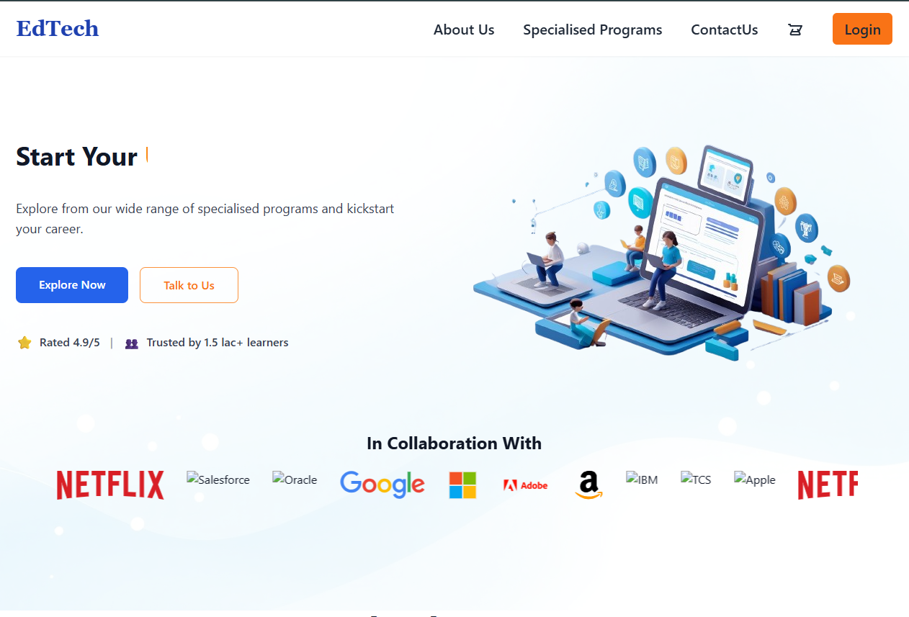
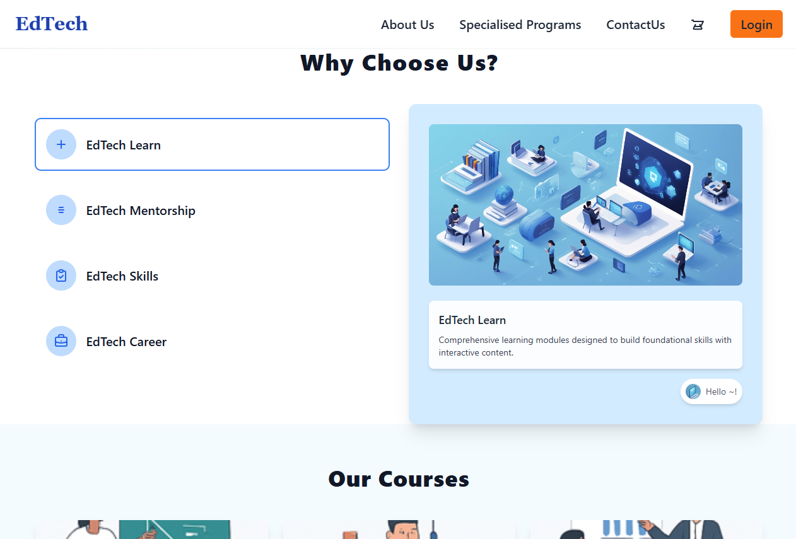
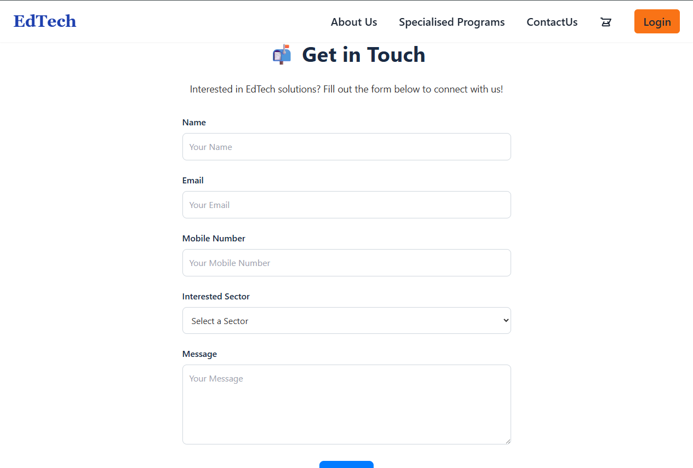
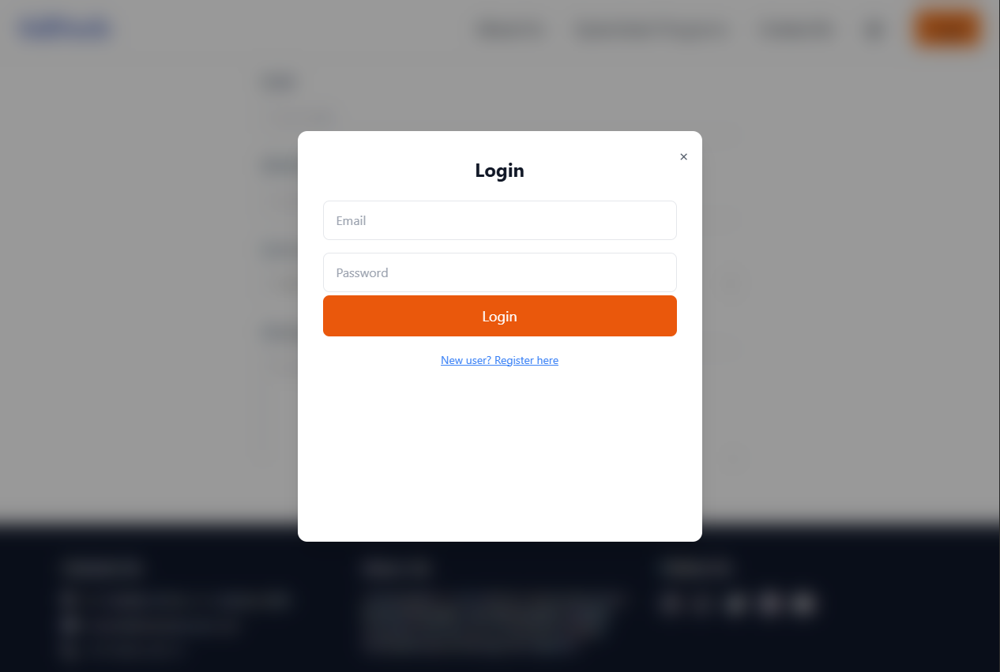

# 🎓 EdTech Website

An educational technology (EdTech) website built to showcase specialised programs, mentorship, and career opportunities.  
This project provides a modern, responsive frontend with sections for learning, mentorship, skills, courses, and contact forms.

---

## 🚀 Features

- **Landing Page** – Hero section with CTA buttons, trusted companies, and ratings.
- **Why Choose Us?** – Highlights EdTech Learn, Mentorship, Skills, and Career paths.
- **Our Courses** – Includes:
  - School Education (K-12)
  - College/University Education
  - Corporate Training
  - Skill Development
  - Competitive Exam Prep
  - Language Learning
- **Contact Form** – Collects user details and messages.
- **Authentication** – Login & Register modal.
- **Responsive Design** – Works across devices.

---

## 🛠️ Tech Stack

- **Frontend:** HTML, CSS, JavaScript  
- **Frameworks/Libraries:** Bootstrap / Tailwind CSS (if used)  
- **Icons & Illustrations:** Custom/Stock assets  

---

## 📂 Project Structure

/edtech-website
├── index.html
├── about.html
├── contact.html
├── css/
├── js/
├── assets/
│ ├── home.png
│ ├── choose.png
│ ├── course.png
│ ├── contact.png
│ └── login.png
└── README.md

yaml
Copy
Edit

---

## 📸 Screenshots

### 🏠 Homepage

### 💡 Why Choose Us

### 📚 Courses

### 📩 Contact

### 🔐 Login

---

## 🤝 Contributing

Pull requests are welcome! For major changes, please open an issue first  
to discuss what you would like to change.

---

## 📧 Contact

For queries, reach out via the **Contact Us** form on the website.